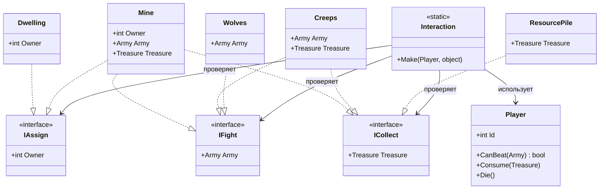

```mermaid
classDiagram
    class IFight {
        <<interface>>
        +Army Army
    }

    class ICollect {
        <<interface>>
        +Treasure Treasure
    }

    class IAssign {
        <<interface>>
        +int Owner
    }

    class Dwelling {
        +int Owner
    }

    class Mine {
        +int Owner
        +Army Army
        +Treasure Treasure
    }

    class Creeps {
        +Army Army
        +Treasure Treasure
    }

    class Wolves {
        +Army Army
    }

    class ResourcePile {
        +Treasure Treasure
    }

    class Player {
        +int Id
        +CanBeat(Army) bool
        +Consume(Treasure)
        +Die()
    }

    class Interaction {
        <<static>>
        +Make(Player, object)
    }

    Dwelling ..|> IAssign
    Mine ..|> IAssign
    Mine ..|> IFight
    Mine ..|> ICollect
    Creeps ..|> IFight
    Creeps ..|> ICollect
    Wolves ..|> IFight
    ResourcePile ..|> ICollect

    Interaction --> Player : использует
    Interaction --> IFight : проверяет
    Interaction --> ICollect : проверяет
    Interaction --> IAssign : проверяет

```

