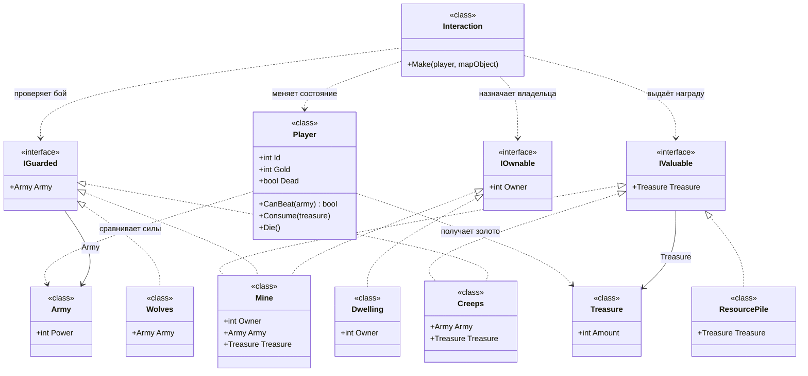

```mermaid

classDiagram
    class IOwnable {
        <<interface>>
        +int Owner
    }

    class IGuarded {
        <<interface>>
        +Army Army
    }

    class IValuable {
        <<interface>>
        +Treasure Treasure
    }

    class Dwelling {
        <<class>>
        +int Owner
    }

    class Mine {
        <<class>>
        +int Owner
        +Army Army
        +Treasure Treasure
    }

    class Creeps {
        <<class>>
        +Army Army
        +Treasure Treasure
    }

    class Wolves {
        <<class>>
        +Army Army
    }

    class ResourcePile {
        <<class>>
        +Treasure Treasure
    }

    class Player {
        <<class>>
        +int Id
        +int Gold
        +bool Dead
        +CanBeat(army) bool
        +Consume(treasure)
        +Die()
    }

    class Army {
        <<class>>
        +int Power
    }

    class Treasure {
        <<class>>
        +int Amount
    }

    class Interaction {
        <<class>>
        +Make(player, mapObject)
    }

    IOwnable <|.. Dwelling
    IOwnable <|.. Mine

    IGuarded <|.. Mine
    IGuarded <|.. Creeps
    IGuarded <|.. Wolves

    IValuable <|.. Mine
    IValuable <|.. Creeps
    IValuable <|.. ResourcePile

    IGuarded --> Army : Army
    IValuable --> Treasure : Treasure

    Interaction ..> Player : меняет состояние
    Interaction ..> IGuarded : проверяет бой
    Interaction ..> IOwnable : назначает владельца
    Interaction ..> IValuable : выдаёт награду

    Player ..> Army : сравнивает силы
    Player ..> Treasure : получает золото

```