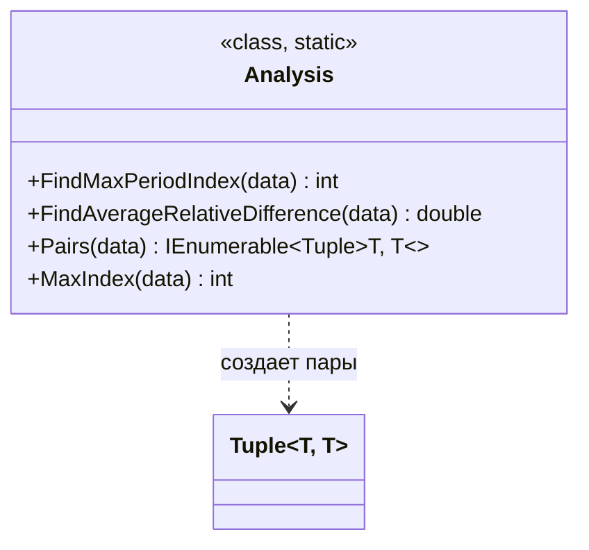

```mermaid
classDiagram
    class Analysis {
        <<class, static>>
        +FindMaxPeriodIndex(data) int
        +FindAverageRelativeDifference(data) double
        +Pairs(data) IEnumerable~Tuple~T, T~~
        +MaxIndex(data) int
    }

    Analysis ..> Tuple~T, T~ : создает пары 

```