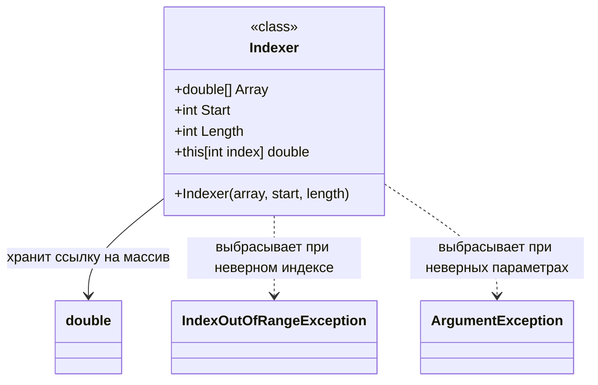

```mermaid
classDiagram
    class Indexer {
        <<class>>
        +double[] Array
        +int Start
        +int Length
        +Indexer(array, start, length)
        +this[int index] double
    }

    Indexer --> double : хранит ссылку на массив
    Indexer ..> IndexOutOfRangeException : выбрасывает при неверном индексе
    Indexer ..> ArgumentException : выбрасывает при неверных параметрах

```