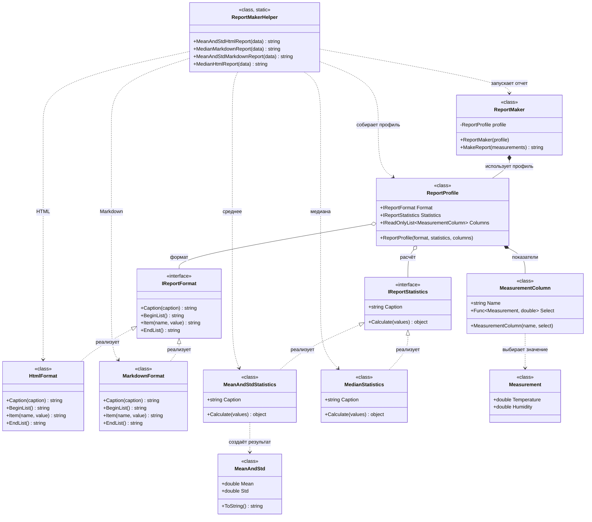

```mermaid
classDiagram
    class ReportMaker {
        <<class>>
        -ReportProfile profile
        +ReportMaker(profile)
        +MakeReport(measurements) string
    }

    class ReportProfile {
        <<class>>
        +IReportFormat Format
        +IReportStatistics Statistics
        +IReadOnlyList~MeasurementColumn~ Columns
        +ReportProfile(format, statistics, columns)
    }

    class MeasurementColumn {
        <<class>>
        +string Name
        +Func~Measurement, double~ Select
        +MeasurementColumn(name, select)
    }

    class IReportFormat {
        <<interface>>
        +Caption(caption) string
        +BeginList() string
        +Item(name, value) string
        +EndList() string
    }

    class HtmlFormat {
        <<class>>
        +Caption(caption) string
        +BeginList() string
        +Item(name, value) string
        +EndList() string
    }

    class MarkdownFormat {
        <<class>>
        +Caption(caption) string
        +BeginList() string
        +Item(name, value) string
        +EndList() string
    }

    class IReportStatistics {
        <<interface>>
        +string Caption
        +Calculate(values) object
    }

    class MeanAndStdStatistics {
        <<class>>
        +string Caption
        +Calculate(values) object
    }

    class MedianStatistics {
        <<class>>
        +string Caption
        +Calculate(values) object
    }

    class ReportMakerHelper {
        <<class, static>>
        +MeanAndStdHtmlReport(data) string
        +MedianMarkdownReport(data) string
        +MeanAndStdMarkdownReport(data) string
        +MedianHtmlReport(data) string
    }

    class Measurement {
        <<class>>
        +double Temperature
        +double Humidity
    }

    class MeanAndStd {
        <<class>>
        +double Mean
        +double Std
        +ToString() string
    }

    IReportFormat <|.. HtmlFormat : реализует
    IReportFormat <|.. MarkdownFormat : реализует

    IReportStatistics <|.. MeanAndStdStatistics : реализует
    IReportStatistics <|.. MedianStatistics : реализует

    ReportMaker *-- ReportProfile : использует профиль
    ReportProfile o-- IReportFormat : формат
    ReportProfile o-- IReportStatistics : расчёт
    ReportProfile *-- MeasurementColumn : показатели

    MeasurementColumn ..> Measurement : выбирает значение
    MeanAndStdStatistics ..> MeanAndStd : создаёт результат

    ReportMakerHelper ..> ReportProfile : собирает профиль
    ReportMakerHelper ..> ReportMaker : запускает отчет
    ReportMakerHelper ..> HtmlFormat : HTML
    ReportMakerHelper ..> MarkdownFormat : Markdown
    ReportMakerHelper ..> MeanAndStdStatistics : среднее
    ReportMakerHelper ..> MedianStatistics : медиана

```