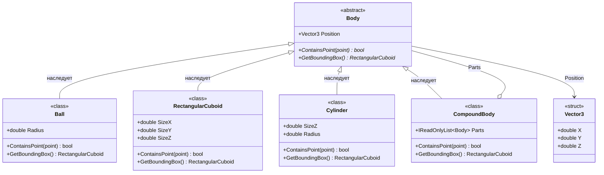

```mermaid
classDiagram
    class Body {
        <<abstract>>
        +Vector3 Position
        +ContainsPoint(point) bool*
        +GetBoundingBox() RectangularCuboid*
    }

    class Ball {
        <<class>>
        +double Radius
        +ContainsPoint(point) bool
        +GetBoundingBox() RectangularCuboid
    }

    class RectangularCuboid {
        <<class>>
        +double SizeX
        +double SizeY
        +double SizeZ
        +ContainsPoint(point) bool
        +GetBoundingBox() RectangularCuboid
    }

    class Cylinder {
        <<class>>
        +double SizeZ
        +double Radius
        +ContainsPoint(point) bool
        +GetBoundingBox() RectangularCuboid
    }

    class CompoundBody {
        <<class>>
        +IReadOnlyList~Body~ Parts
        +ContainsPoint(point) bool
        +GetBoundingBox() RectangularCuboid
    }

    class Vector3 {
        <<struct>>
        +double X
        +double Y
        +double Z
    }

    Body <|-- Ball : наследует
    Body <|-- RectangularCuboid : наследует
    Body <|-- Cylinder : наследует
    Body <|-- CompoundBody : наследует
    Body --> Vector3 : Position
    CompoundBody o-- Body : Parts   

```