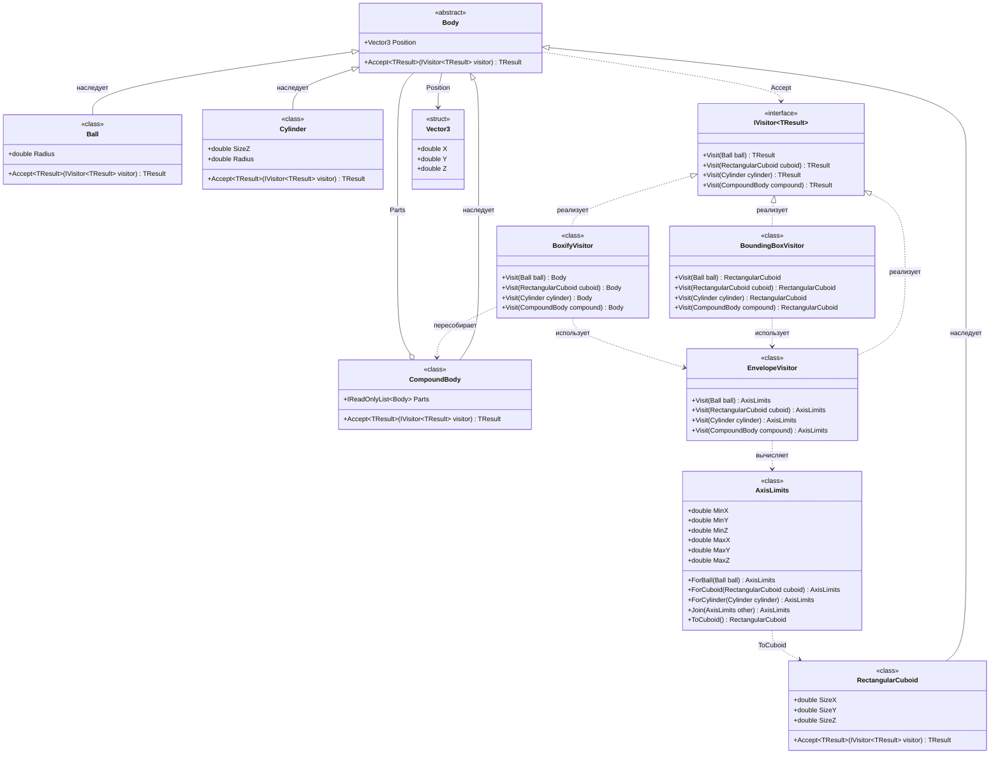

```mermaid

classDiagram
    class Body {
        <<abstract>>
        +Vector3 Position
        +Accept~TResult~(IVisitor~TResult~ visitor) TResult
    }

    class Ball {
        <<class>>
        +double Radius
        +Accept~TResult~(IVisitor~TResult~ visitor) TResult
    }

    class Cylinder {
        <<class>>
        +double SizeZ
        +double Radius
        +Accept~TResult~(IVisitor~TResult~ visitor) TResult
    }

    class RectangularCuboid {
        <<class>>
        +double SizeX
        +double SizeY
        +double SizeZ
        +Accept~TResult~(IVisitor~TResult~ visitor) TResult
    }

    class CompoundBody {
        <<class>>
        +IReadOnlyList~Body~ Parts
        +Accept~TResult~(IVisitor~TResult~ visitor) TResult
    }

    class IVisitor~TResult~ {
        <<interface>>
        +Visit(Ball ball) TResult
        +Visit(RectangularCuboid cuboid) TResult
        +Visit(Cylinder cylinder) TResult
        +Visit(CompoundBody compound) TResult
    }

    class AxisLimits {
        <<class>>
        +double MinX
        +double MinY
        +double MinZ
        +double MaxX
        +double MaxY
        +double MaxZ
        +ForBall(Ball ball) AxisLimits
        +ForCuboid(RectangularCuboid cuboid) AxisLimits
        +ForCylinder(Cylinder cylinder) AxisLimits
        +Join(AxisLimits other) AxisLimits
        +ToCuboid() RectangularCuboid
    }

    class EnvelopeVisitor {
        <<class>>
        +Visit(Ball ball) AxisLimits
        +Visit(RectangularCuboid cuboid) AxisLimits
        +Visit(Cylinder cylinder) AxisLimits
        +Visit(CompoundBody compound) AxisLimits
    }

    class BoundingBoxVisitor {
        <<class>>
        +Visit(Ball ball) RectangularCuboid
        +Visit(RectangularCuboid cuboid) RectangularCuboid
        +Visit(Cylinder cylinder) RectangularCuboid
        +Visit(CompoundBody compound) RectangularCuboid
    }

    class BoxifyVisitor {
        <<class>>
        +Visit(Ball ball) Body
        +Visit(RectangularCuboid cuboid) Body
        +Visit(Cylinder cylinder) Body
        +Visit(CompoundBody compound) Body
    }

    class Vector3 {
        <<struct>>
        +double X
        +double Y
        +double Z
    }

    Body <|-- Ball : наследует
    Body <|-- Cylinder : наследует
    Body <|-- RectangularCuboid : наследует
    Body <|-- CompoundBody : наследует

    IVisitor~AxisLimits~ <|.. EnvelopeVisitor : реализует
    IVisitor~RectangularCuboid~ <|.. BoundingBoxVisitor : реализует
    IVisitor~Body~ <|.. BoxifyVisitor : реализует

    Body --> Vector3 : Position
    CompoundBody o-- Body : Parts

    Body ..> IVisitor~TResult~ : Accept
    EnvelopeVisitor ..> AxisLimits : вычисляет
    AxisLimits ..> RectangularCuboid : ToCuboid
    BoundingBoxVisitor ..> EnvelopeVisitor : использует
    BoxifyVisitor ..> EnvelopeVisitor : использует
    BoxifyVisitor ..> CompoundBody : пересобирает
```