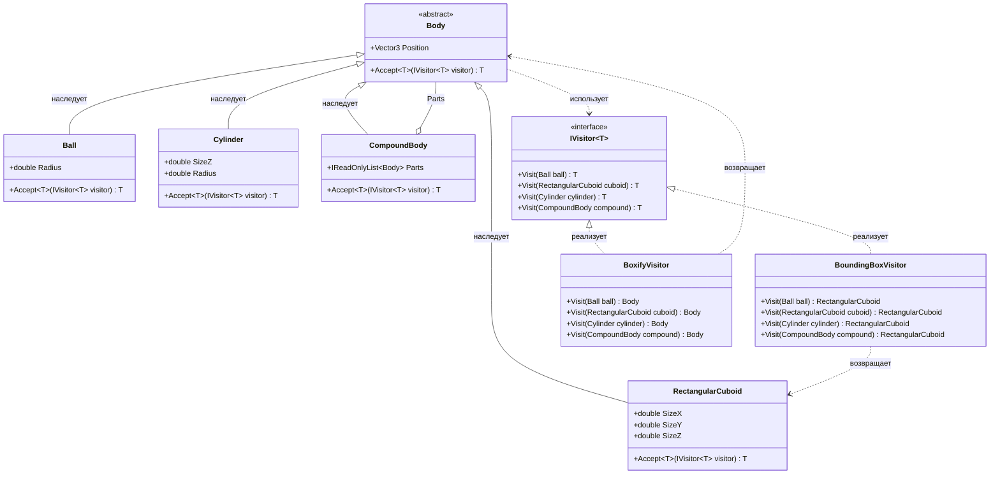

```mermaid

classDiagram
    class Body {
        <<abstract>>
        +Vector3 Position
        +Accept~T~(IVisitor~T~ visitor) T
    }

    class Ball {
        +double Radius
        +Accept~T~(IVisitor~T~ visitor) T
    }

    class Cylinder {
        +double SizeZ
        +double Radius
        +Accept~T~(IVisitor~T~ visitor) T
    }

    class RectangularCuboid {
        +double SizeX
        +double SizeY
        +double SizeZ
        +Accept~T~(IVisitor~T~ visitor) T
    }

    class CompoundBody {
        +IReadOnlyList~Body~ Parts
        +Accept~T~(IVisitor~T~ visitor) T
    }

    class IVisitor~T~ {
        <<interface>>
        +Visit(Ball ball) T
        +Visit(RectangularCuboid cuboid) T
        +Visit(Cylinder cylinder) T
        +Visit(CompoundBody compound) T
    }

    class BoundingBoxVisitor {
        +Visit(Ball ball) RectangularCuboid
        +Visit(RectangularCuboid cuboid) RectangularCuboid
        +Visit(Cylinder cylinder) RectangularCuboid
        +Visit(CompoundBody compound) RectangularCuboid
    }

    class BoxifyVisitor {
        +Visit(Ball ball) Body
        +Visit(RectangularCuboid cuboid) Body
        +Visit(Cylinder cylinder) Body
        +Visit(CompoundBody compound) Body
    }

    Body <|-- Ball : наследует
    Body <|-- Cylinder : наследует
    Body <|-- RectangularCuboid : наследует
    Body <|-- CompoundBody : наследует

    IVisitor~RectangularCuboid~ <|.. BoundingBoxVisitor : реализует
    IVisitor~Body~ <|.. BoxifyVisitor : реализует

    CompoundBody o-- Body : Parts

    Body ..> IVisitor~T~ : использует
    BoundingBoxVisitor ..> RectangularCuboid : возвращает
    BoxifyVisitor ..> Body : возвращает
```
