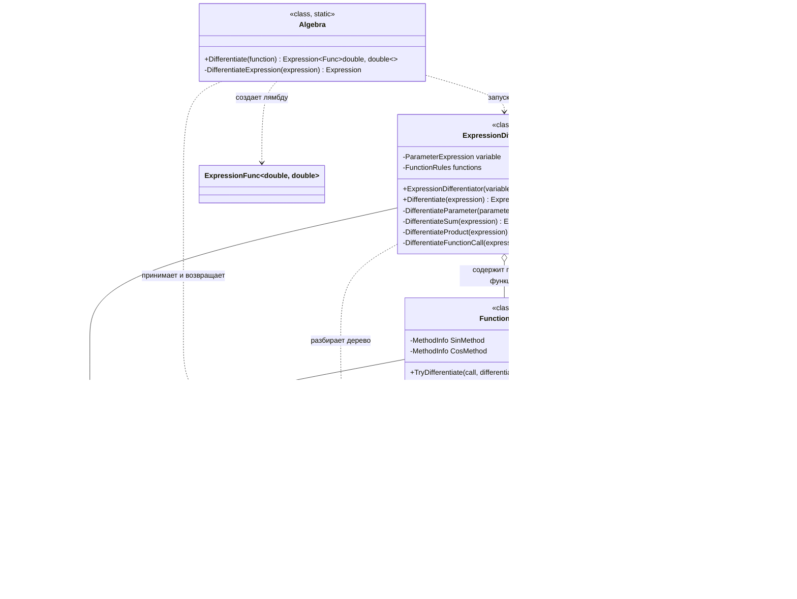

```mermaid
classDiagram
    class Algebra {
        <<class, static>>
        +Differentiate(function) Expression~Func~double, double~~
        -DifferentiateExpression(expression) Expression
    }

    class ExpressionDifferentiator {
        <<class>>
        -ParameterExpression variable
        -FunctionRules functions
        +ExpressionDifferentiator(variable)
        +Differentiate(expression) Expression
        -DifferentiateParameter(parameter) Expression
        -DifferentiateSum(expression) Expression
        -DifferentiateProduct(expression) Expression
        -DifferentiateFunctionCall(expression) Expression
    }

    class FunctionRules {
        <<class>>
        -MethodInfo SinMethod
        -MethodInfo CosMethod
        +TryDifferentiate(call, differentiate, derivative) bool
    }

    class Expression {
        <<abstract>>
        +System.Linq.Expressions
    }

    class ParameterExpression {
        <<class>>
        +System.Linq.Expressions
    }

    class ConstantExpression {
        <<class>>
        +System.Linq.Expressions
    }

    class BinaryExpression {
        <<class>>
        +System.Linq.Expressions
    }

    class MethodCallExpression {
        <<class>>
        +System.Linq.Expressions
    }

    class MethodInfo {
        <<class>>
        +System.Reflection
    }

    Expression <|-- ParameterExpression : наследует
    Expression <|-- ConstantExpression : наследует
    Expression <|-- BinaryExpression : наследует
    Expression <|-- MethodCallExpression : наследует

    Algebra ..> Expression : принимает и возвращает
    Algebra ..> ExpressionDifferentiator : запускает
    Algebra ..> Expression Func~double, double~ : создает лямбду

    ExpressionDifferentiator o-- FunctionRules : содержит правила функций
    ExpressionDifferentiator --> ParameterExpression : переменная дифференцирования
    ExpressionDifferentiator ..> Expression : разбирает дерево
    ExpressionDifferentiator ..> BinaryExpression : сумма и произведение
    ExpressionDifferentiator ..> MethodCallExpression : вызов функции

    FunctionRules --> MethodInfo : Sin и Cos
    FunctionRules ..> MethodCallExpression : проверяет метод
    FunctionRules ..> Expression : строит производную

```