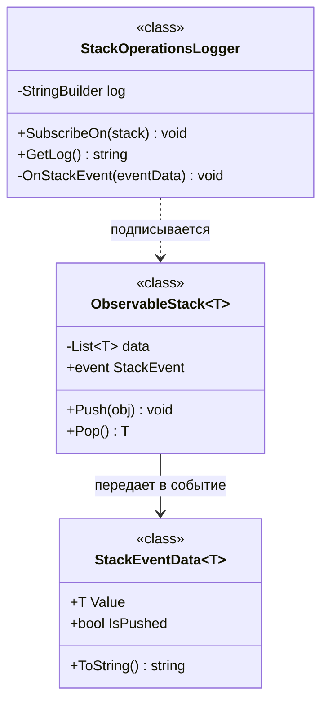

```mermaid
classDiagram
    class ObservableStack~T~ {
        <<class>>
        -List~T~ data
        +event StackEvent
        +Push(obj) void
        +Pop() T
    }

    class StackEventData~T~ {
        <<class>>
        +T Value
        +bool IsPushed
        +ToString() string
    }

    class StackOperationsLogger {
        <<class>>
        -StringBuilder log
        +SubscribeOn(stack) void
        +GetLog() string
        -OnStackEvent(eventData) void
    }

    ObservableStack~T~ --> StackEventData~T~ : передает в событие
    StackOperationsLogger ..> ObservableStack~T~ : подписывается

```