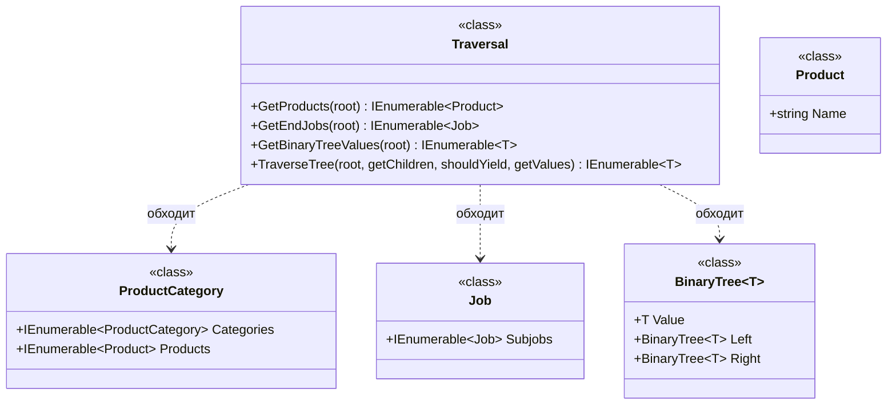

```mermaid
classDiagram
    class Traversal {
        <<class>>
        +GetProducts(root) IEnumerable~Product~
        +GetEndJobs(root) IEnumerable~Job~
        +GetBinaryTreeValues(root) IEnumerable~T~
        +TraverseTree(root, getChildren, shouldYield, getValues) IEnumerable~T~
    }

    class ProductCategory {
        <<class>>
        +IEnumerable~ProductCategory~ Categories
        +IEnumerable~Product~ Products
    }

    class Product {
        <<class>>
        +string Name
    }

    class Job {
        <<class>>
        +IEnumerable~Job~ Subjobs
    }

    class BinaryTree~T~ {
        <<class>>
        +T Value
        +BinaryTree~T~ Left
        +BinaryTree~T~ Right
    }

    Traversal ..> ProductCategory : обходит
    Traversal ..> Job : обходит
    Traversal ..> BinaryTree~T~ : обходит

```