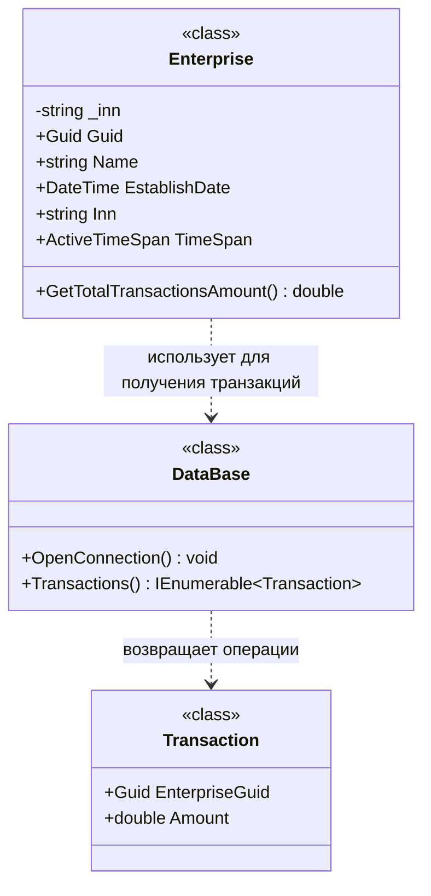

```mermaid
classDiagram
    class Enterprise {
        <<class>>
        -string _inn
        +Guid Guid
        +string Name
        +DateTime EstablishDate
        +string Inn
        +ActiveTimeSpan TimeSpan
        +GetTotalTransactionsAmount() double
    }

    class Transaction {
        <<class>>
        +Guid EnterpriseGuid
        +double Amount
    }

    class DataBase {
        <<class>>
        +OpenConnection() void
        +Transactions() IEnumerable~Transaction~
    }

    Enterprise ..> DataBase : использует для получения транзакций
    DataBase ..> Transaction : возвращает операции
```