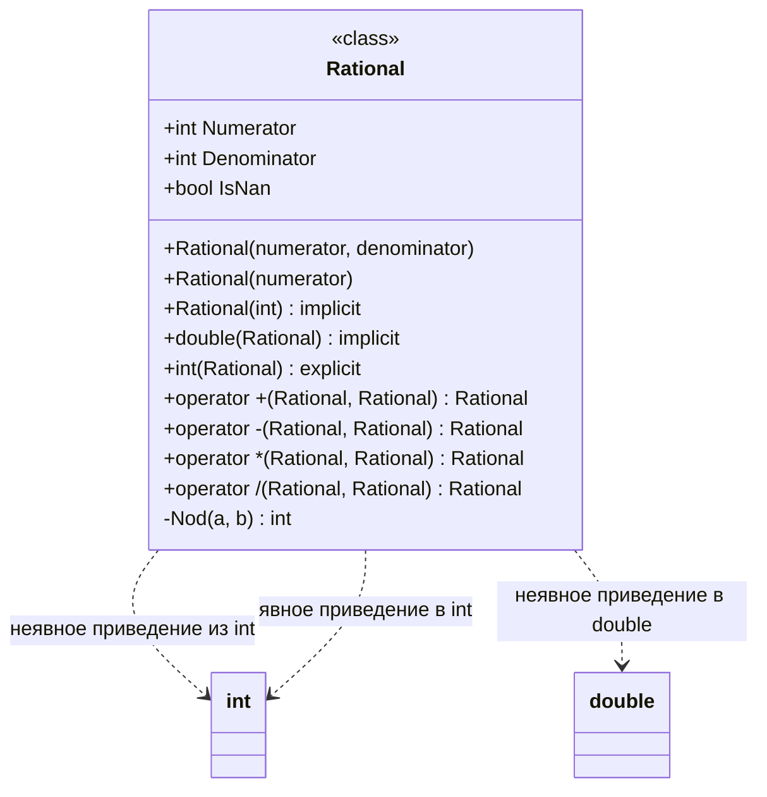

```mermaid

classDiagram
    class Rational {
        <<class>>
        +int Numerator
        +int Denominator
        +bool IsNan
        +Rational(numerator, denominator)
        +Rational(numerator)
        +Rational(int) implicit
        +double(Rational) implicit
        +int(Rational) explicit
        +operator +(Rational, Rational) Rational
        +operator -(Rational, Rational) Rational
        +operator *(Rational, Rational) Rational
        +operator /(Rational, Rational) Rational
        -Nod(a, b) int
    }

    Rational ..> int : неявное приведение из int
    Rational ..> double : неявное приведение в double
    Rational ..> int : явное приведение в int
    
```