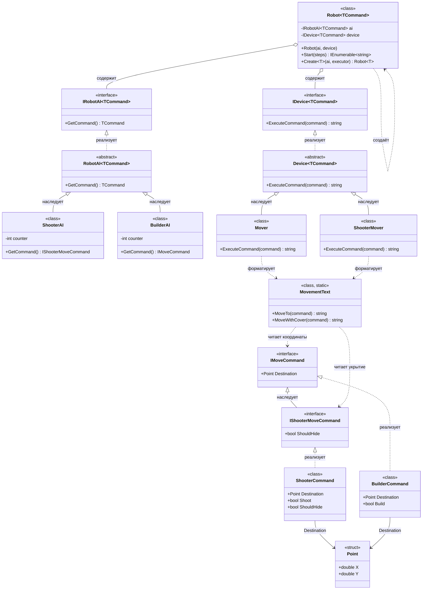

```mermaid
classDiagram
    class IRobotAI~TCommand~ {
        <<interface>>
        <<out TCommand>>
        +GetCommand() TCommand
    }

    class IDevice~TCommand~ {
        <<interface>>
        <<in TCommand>>
        +ExecuteCommand(command) string
    }

    class RobotAI~TCommand~ {
        <<abstract>>
        +GetCommand() TCommand
    }

    class Device~TCommand~ {
        <<abstract>>
        +ExecuteCommand(command) string
    }

    class ShooterAI {
        <<class>>
        -int counter
        +GetCommand() IShooterMoveCommand
    }

    class BuilderAI {
        <<class>>
        -int counter
        +GetCommand() IMoveCommand
    }

    class Mover {
        <<class>>
        +ExecuteCommand(command) string
    }

    class ShooterMover {
        <<class>>
        +ExecuteCommand(command) string
    }

    class Robot~TCommand~ {
        <<class>>
        -IRobotAI~TCommand~ ai
        -IDevice~TCommand~ device
        +Robot(ai, device)
        +Start(steps) IEnumerable~string~
    }

    class Robot {
        <<class, static>>
        +Create~T~(ai, executor) Robot~T~
    }

    class MovementText {
        <<class, static>>
        +MoveTo(command) string
        +MoveWithCover(command) string
    }

    class IMoveCommand {
        <<interface>>
        +Point Destination
    }

    class IShooterMoveCommand {
        <<interface>>
        +bool ShouldHide
    }

    class ShooterCommand {
        <<class>>
        +Point Destination
        +bool Shoot
        +bool ShouldHide
    }

    class BuilderCommand {
        <<class>>
        +Point Destination
        +bool Build
    }

    class Point {
        <<struct>>
        +double X
        +double Y
    }

    IRobotAI~TCommand~ <|.. RobotAI~TCommand~ : реализует
    IDevice~TCommand~ <|.. Device~TCommand~ : реализует

    RobotAI~IShooterMoveCommand~ <|-- ShooterAI : наследует
    RobotAI~IMoveCommand~ <|-- BuilderAI : наследует

    Device~IMoveCommand~ <|-- Mover : наследует
    Device~IShooterMoveCommand~ <|-- ShooterMover : наследует

    IMoveCommand <|-- IShooterMoveCommand : наследует
    IShooterMoveCommand <|.. ShooterCommand : реализует
    IMoveCommand <|.. BuilderCommand : реализует

    ShooterCommand --> Point : Destination
    BuilderCommand --> Point : Destination

    Robot~TCommand~ o-- IRobotAI~TCommand~ : содержит
    Robot~TCommand~ o-- IDevice~TCommand~ : содержит
    Robot ..> Robot~TCommand~ : создаёт

    Mover ..> MovementText : форматирует
    ShooterMover ..> MovementText : форматирует
    MovementText ..> IMoveCommand : читает координаты
    MovementText ..> IShooterMoveCommand : читает укрытие

```