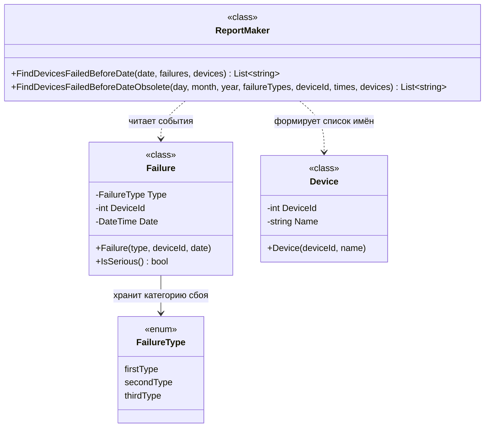

```mermaid
classDiagram
    class Failure {
        <<class>>
        -FailureType Type
        -int DeviceId
        -DateTime Date
        +Failure(type, deviceId, date)
        +IsSerious() bool
    }

    class Device {
        <<class>>
        -int DeviceId
        -string Name
        +Device(deviceId, name)
    }

    class FailureType {
        <<enum>>
        firstType
        secondType
        thirdType
    }

    class ReportMaker {
        <<class>>
        +FindDevicesFailedBeforeDate(date, failures, devices) List~string~
        +FindDevicesFailedBeforeDateObsolete(day, month, year, failureTypes, deviceId, times, devices) List~string~
    }

    Failure --> FailureType : хранит категорию сбоя
    ReportMaker ..> Failure : читает события
    ReportMaker ..> Device : формирует список имён

```
