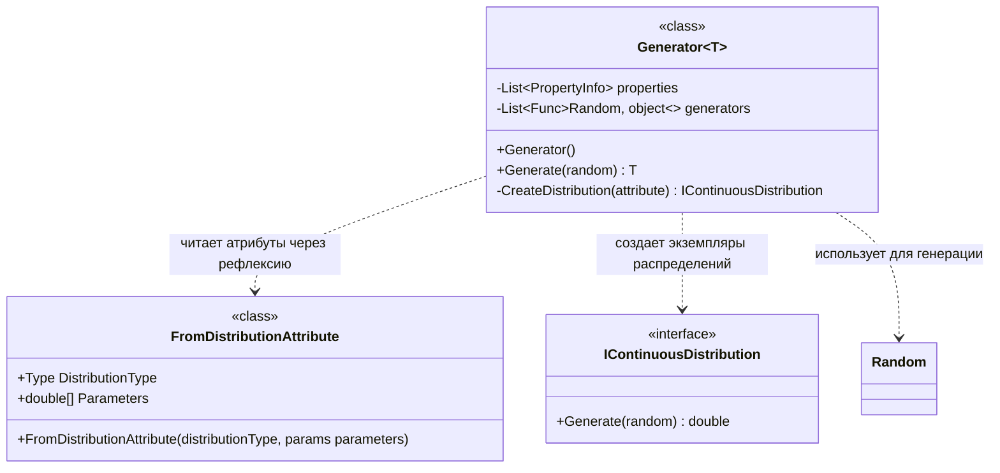

```mermaid

classDiagram
    class FromDistributionAttribute {
        <<class>>
        +Type DistributionType
        +double[] Parameters
        +FromDistributionAttribute(distributionType, params parameters)
    }

    class Generator~T~ {
        <<class>>
        -List~PropertyInfo~ properties
        -List~Func~Random, object~~ generators
        +Generator()
        +Generate(random) T
        -CreateDistribution(attribute) IContinuousDistribution
    }

    class IContinuousDistribution {
        <<interface>>
        +Generate(random) double
    }

    Generator~T~ ..> FromDistributionAttribute : читает атрибуты через рефлексию
    Generator~T~ ..> IContinuousDistribution : создает экземпляры распределений
    Generator~T~ ..> Random : использует для генерации

```