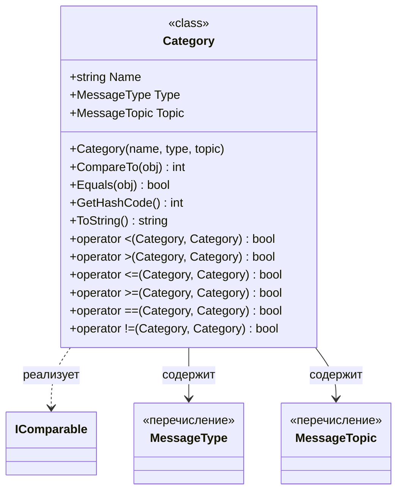

```mermaid
classDiagram
    class Category {
        <<class>>
        +string Name
        +MessageType Type
        +MessageTopic Topic
        +Category(name, type, topic)
        +CompareTo(obj) int
        +Equals(obj) bool
        +GetHashCode() int
        +ToString() string
        +operator <(Category, Category) bool
        +operator >(Category, Category) bool
        +operator <=(Category, Category) bool
        +operator >=(Category, Category) bool
        +operator ==(Category, Category) bool
        +operator !=(Category, Category) bool
    }

    class MessageType {
        <<перечисление>>
    }

    class MessageTopic {
        <<перечисление>>
    }

    Category ..> IComparable : реализует
    Category --> MessageType : содержит
    Category --> MessageTopic : содержит

```