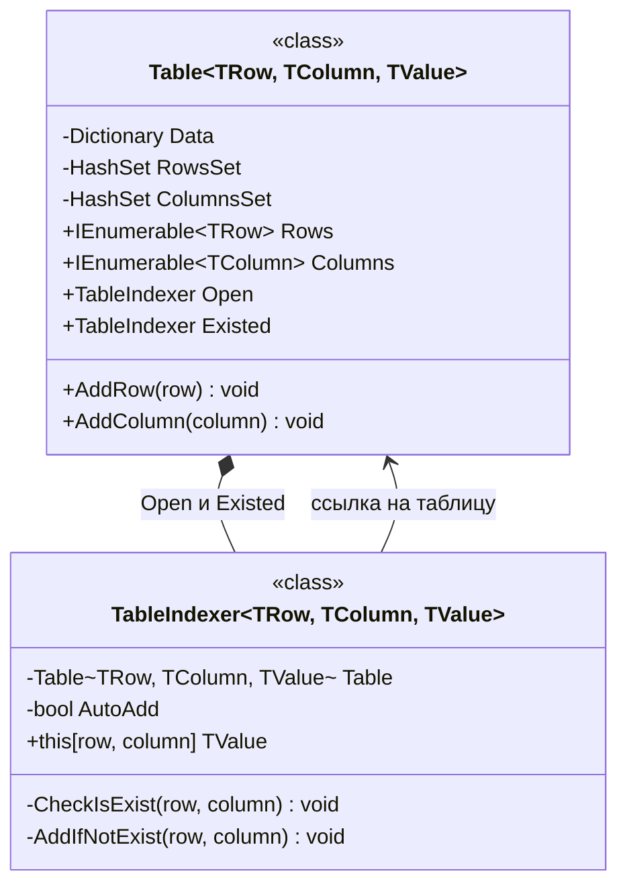

```mermaid
classDiagram
    class Table~TRow, TColumn, TValue~ {
        <<class>>
        -Dictionary Data
        -HashSet RowsSet
        -HashSet ColumnsSet
        +IEnumerable~TRow~ Rows
        +IEnumerable~TColumn~ Columns
        +TableIndexer Open
        +TableIndexer Existed
        +AddRow(row) void
        +AddColumn(column) void
    }

    class TableIndexer~TRow, TColumn, TValue~ {
        <<class>>
        -Table~TRow, TColumn, TValue~ Table
        -bool AutoAdd
        +this[row, column] TValue
        -CheckIsExist(row, column) void
        -AddIfNotExist(row, column) void
    }

    Table~TRow, TColumn, TValue~ *-- TableIndexer~TRow, TColumn, TValue~ : Open и Existed
    TableIndexer~TRow, TColumn, TValue~ --> Table~TRow, TColumn, TValue~ : ссылка на таблицу

```